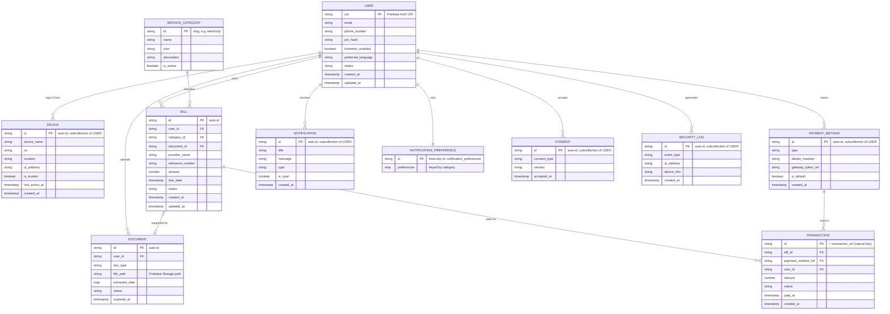

# Database Schema — AI Life Admin (Firebase / Cloud Firestore)

> อ้างอิงแนวทางจาก [RAISE2_W4D1_TechnicalSpec.pdf](RAISE2_W4D1_TechnicalSpec.pdf) (Conceptual → Logical → Physical Schema, ERD ด้วย Mermaid.js)
> ขอบเขต entity อ้างอิงจากหน้าจอแอป AI Life Admin (Onboarding, Auth & Security, Home/Services, Document Scan, Payment, Account/Security Management)
> **Database: Cloud Firestore (NoSQL, Document-based)** — ปรับจากฉบับ PostgreSQL เดิม เอกสารนี้ยังเป็น draft ควรทวนกับ Requirement/Feature List ก่อนใช้จริง

---

## 1. แนวทางการออกแบบสำหรับ Firestore

Firestore เป็น NoSQL document database — ไม่มี JOIN/Foreign Key คอนสเตรนต์แบบ RDBMS จึงออกแบบตามหลัก **query-first** (ออกแบบตามรูปแบบการอ่านข้อมูลของหน้าจอแอป) แทนการ normalize แบบ SQL:

- **Subcollection** (`users/{userId}/...`) ใช้กับข้อมูลที่ query แบบ scoped ต่อผู้ใช้เจ้าของเสมอ (device, payment method, notification, consent, security log) — ทำให้ Security Rules ง่าย (`request.auth.uid == userId`) และไม่ต้องทำ composite index ข้าม user
- **Top-level collection** (`bills`, `documents`, `transactions`) ใช้กับข้อมูลที่ต้อง query ข้ามผู้ใช้ได้ (เช่น Cloud Scheduler job ไล่เช็คบิลเกินกำหนดของทุกคน) — เก็บ `user_id` เป็น field เพื่อ filter และตรวจสิทธิ์
- ฟิลด์ `password_hash` แบบเดิมไม่จำเป็นอีกต่อไป เพราะ **Firebase Authentication** จัดการ credential ให้ทั้งหมด (ไม่เก็บรหัสผ่านใน Firestore)
- ไม่มี `otp_verifications` collection แยกต่างหาก เพราะเบอร์โทร OTP ใช้ **Firebase Authentication Phone Provider** (ฝั่ง client เรียก `signInWithPhoneNumber` โดยตรง, Firebase จัดการส่ง/ตรวจ OTP ให้)
- การอัปเดตข้อมูลการเงิน (เช่น `bills.status = paid`, `transactions`) ต้องทำผ่าน **Cloud Functions (Admin SDK)** เท่านั้น ไม่อนุญาตให้ client เขียนตรงผ่าน Security Rules — ป้องกันการปลอมสถานะจ่ายเงินจากฝั่ง client

---

## 2. Conceptual Schema

| Entity | คำอธิบาย |
|---|---|
| **User** | ผู้ใช้งานแอป (ผูกกับ Firebase Auth UID) พร้อมการตั้งค่าความปลอดภัย |
| **Device** | อุปกรณ์ที่ผู้ใช้ล็อกอินเข้าใช้งาน (สำหรับหน้า Active Sessions) |
| **Document** | เอกสารที่สแกน (บัตรประชาชน ฯลฯ) และผลลัพธ์จาก AI extraction |
| **Service Category** | หมวดหมู่บริการ/บิล เช่น ค่าไฟฟ้า, ค่าน้ำประปา, ภาษี, ตรวจสุขภาพ |
| **Bill (Task)** | รายการบิล/ธุระที่ต้องดำเนินการของผู้ใช้ ผูกกับ Service Category |
| **Payment Method** | ช่องทางชำระเงินที่ผู้ใช้บันทึกไว้ (PromptPay, บัตรเครดิต/เดบิต) |
| **Transaction** | ธุรกรรมการชำระเงินของ Bill แต่ละรายการ |
| **Notification** | การแจ้งเตือนที่ส่งถึงผู้ใช้ (ส่งจริงผ่าน Firebase Cloud Messaging) |
| **Notification Preference** | การตั้งค่าว่าผู้ใช้ต้องการรับแจ้งเตือนช่องทาง/หมวดใดบ้าง |
| **Consent** | บันทึกการยอมรับ Terms & Conditions / PDPA |
| **Security Log** | บันทึกเหตุการณ์ด้านความปลอดภัย (login, เปลี่ยนรหัสผ่าน, verify device) |

**ความสัมพันธ์หลัก:** User 1–N Device, User 1–N Document, User 1–N Bill, Service Category 1–N Bill, User 1–N Payment Method, Bill 1–N Transaction, Payment Method 1–N Transaction, User 1–N Notification, User 1–1 Notification Preference (doc เดียวเก็บทุก category เป็น map), User 1–N Consent, User 1–N Security Log

---

## 3. Logical Schema (ERD — แนวคิดความสัมพันธ์)



---

## 4. Firestore Data Model (Physical Schema)

### 4.1 `users/{userId}`
Doc ID = Firebase Authentication UID (ไม่ auto-generate)

| Field | Type | Notes |
|---|---|---|
| email | string \| null | ซิงก์มาจาก Firebase Auth ตอนสมัคร |
| phone_number | string \| null | ซิงก์มาจาก Firebase Auth (E.164 format) |
| pin_hash | string \| null | hash ฝั่ง client/Cloud Function ก่อนบันทึก ห้ามเก็บ PIN แบบ plain |
| biometric_enabled | boolean | default `false` |
| preferred_language | string | default `"th"` |
| status | string | `active` \| `suspended` |
| created_at | timestamp | server timestamp |
| updated_at | timestamp | server timestamp |

*(รหัสผ่านไม่ถูกเก็บใน document นี้ — จัดการโดย Firebase Authentication ทั้งหมด)*

### 4.2 `users/{userId}/devices/{deviceId}`
| Field | Type | Notes |
|---|---|---|
| device_name | string | |
| os | string | |
| location | string | |
| ip_address | string | |
| is_trusted | boolean | default `false` |
| last_active_at | timestamp | |
| created_at | timestamp | |

Index: single-field index บน `last_active_at` (Firestore สร้างอัตโนมัติ)

### 4.3 `documents/{documentId}` *(top-level)*
| Field | Type | Notes |
|---|---|---|
| user_id | string | Firebase Auth UID เจ้าของ |
| doc_type | string | เช่น `national_id` |
| file_path | string | path บน Firebase Storage เช่น `users/{uid}/documents/{id}.jpg` |
| extracted_data | map \| null | ผลลัพธ์จาก AI/OCR |
| status | string | `pending` \| `reviewed` |
| scanned_at | timestamp | |

Composite index: `(user_id ASC, scanned_at DESC)`

### 4.4 `service_categories/{categoryId}` *(top-level, reference data)*
Doc ID = slug ที่อ่านง่าย เช่น `electricity`, `water`, `tax`, `health_checkup`

| Field | Type | Notes |
|---|---|---|
| name | string | เช่น ค่าไฟฟ้า, ค่าน้ำประปา |
| icon | string | |
| description | string | |
| is_active | boolean | default `true` |

### 4.5 `bills/{billId}` *(top-level)*
| Field | Type | Notes |
|---|---|---|
| user_id | string | เจ้าของบิล |
| category_id | string | อ้างอิง `service_categories` |
| document_id | string \| null | อ้างอิง `documents` |
| provider_name | string \| null | |
| reference_number | string \| null | |
| amount | number | หน่วย THB |
| due_date | timestamp | |
| status | string | `pending` \| `processing` \| `paid` \| `overdue` \| `cancelled` \| `appointment` |
| created_at | timestamp | |
| updated_at | timestamp | |

`appointment` คือรายการเตือนความจำที่ไม่มีการชำระเงิน (เช่น นัดตรวจสุขภาพ) — `amount` เป็น 0 และไม่ถูกนับเป็นบิลที่ต้อง claim/charge ในระบบชำระเงิน หรือถูก flag เป็น overdue โดย Cloud Scheduler

Composite indexes: `(user_id ASC, status ASC, due_date ASC)`, `(status ASC, due_date ASC)` — สำหรับ Cloud Scheduler ไล่เช็คบิลเกินกำหนดของทุกผู้ใช้

### 4.6 `users/{userId}/payment_methods/{paymentMethodId}`
| Field | Type | Notes |
|---|---|---|
| type | string | `promptpay` \| `credit_card` \| `debit_card` \| `auto_debit` |
| details_masked | string | เช่น เลขบัตรแบบ mask |
| gateway_token_ref | string | token จาก Payment Gateway — **ไม่เก็บเลขบัตร/พร้อมเพย์เต็มจำนวน** |
| is_default | boolean | default `false` |
| created_at | timestamp | |

### 4.7 `transactions/{transactionId}` *(top-level)*
Doc ID = `transaction_ref` (เช่น `TX2025061500001`) — ใช้เป็น natural key เพื่อความ unique โดยไม่ต้องพึ่ง unique index

| Field | Type | Notes |
|---|---|---|
| bill_id | string | อ้างอิง `bills` |
| payment_method_ref | string | path เช่น `users/{uid}/payment_methods/{pmId}` |
| user_id | string | denormalized ไว้เพื่อ query/Security Rules |
| amount | number | |
| status | string | `processing` \| `success` \| `failed` |
| paid_at | timestamp \| null | |
| created_at | timestamp | |

Composite index: `(user_id ASC, created_at DESC)` · เขียนได้จาก **Cloud Functions (Admin SDK) เท่านั้น**

### 4.8 `users/{userId}/notifications/{notificationId}`
| Field | Type | Notes |
|---|---|---|
| title | string | |
| message | string | |
| type | string | `bill_reminder` \| `payment_success` \| `security_alert` |
| is_read | boolean | default `false` |
| created_at | timestamp | |

Composite index: `(is_read ASC, created_at DESC)`

### 4.9 `users/{userId}/settings/notification_preferences`
Fixed doc ID `notification_preferences` — เก็บทุก category เป็น map เดียว (แทนตารางแยกในเวอร์ชัน SQL)

```json
{
  "bill_reminder":    { "push_enabled": true, "email_enabled": true,  "sms_enabled": false },
  "payment_success":  { "push_enabled": true, "email_enabled": false, "sms_enabled": false },
  "security_alert":   { "push_enabled": true, "email_enabled": true,  "sms_enabled": true  }
}
```

### 4.10 `users/{userId}/consents/{consentId}`
| Field | Type | Notes |
|---|---|---|
| consent_type | string | `terms` \| `pdpa` |
| version | string | |
| accepted_at | timestamp | |

### 4.11 `users/{userId}/security_logs/{logId}`
| Field | Type | Notes |
|---|---|---|
| event_type | string | `login` \| `pin_changed` \| `device_verified` \| `password_reset` |
| ip_address | string | |
| device_info | string | |
| created_at | timestamp | |

Composite index: `(created_at DESC)` — Firestore สร้าง single-field index ให้อัตโนมัติ

---

## 5. Firestore Security Rules (สรุปหลักการ)

```
rules_version = '2';
service cloud.firestore {
  match /databases/{database}/documents {

    match /users/{userId} {
      allow read, update: if request.auth.uid == userId;
      allow create: if request.auth.uid == userId;

      match /{subcollection}/{docId} {
        allow read, write: if request.auth.uid == userId;
      }
    }

    match /service_categories/{categoryId} {
      allow read: if request.auth != null;
      allow write: if false; // จัดการผ่าน Admin/Cloud Function เท่านั้น
    }

    match /documents/{documentId} {
      allow read: if resource.data.user_id == request.auth.uid;
      allow create: if request.resource.data.user_id == request.auth.uid;
      allow update, delete: if false; // extracted_data เขียนได้เฉพาะ Cloud Function
    }

    match /bills/{billId} {
      allow read: if resource.data.user_id == request.auth.uid;
      allow create: if request.resource.data.user_id == request.auth.uid;
      // ห้าม client แก้ status เป็น "paid" เอง ต้องผ่าน Cloud Function (Admin SDK)
      allow update: if resource.data.user_id == request.auth.uid
                    && request.resource.data.status != 'paid';
    }

    match /transactions/{transactionId} {
      allow read: if resource.data.user_id == request.auth.uid;
      allow write: if false; // Cloud Functions (Admin SDK) เท่านั้น
    }
  }
}
```

---

## 6. ข้อสมมติฐาน & สิ่งที่ต้องทวนสอบ

- Schema นี้ร่างจากหน้าจอ UI ที่มีอยู่ (mockup) ไม่ใช่จาก Requirement Spec ฉบับทางการ — ควรตรวจกับทีม Product ก่อนใช้จริง
- OTP ผ่านเบอร์โทรใช้ Firebase Authentication Phone Provider โดยตรง หากต้องการ OTP ทาง email เพิ่มเติม ต้องออกแบบ collection แยก (เช่น `otp_requests` + Firestore TTL policy) และ Cloud Function ประกอบเอง เพราะ Firebase Auth ไม่รองรับ Email OTP แบบ native (มีแต่ Email Link Sign-in)
- ยังไม่ระบุ multi-currency/multi-tenant — ถือว่าระบบใช้สกุลเงินเดียว (THB)
- ข้อมูลบัตร/PromptPay เก็บผ่าน token ของ Payment Gateway เท่านั้น ไม่เก็บ raw data ใน Firestore ตาม PCI-DSS
- การเขียนข้อมูลด้านการเงิน (`bills.status=paid`, `transactions`) ต้องผ่าน Cloud Functions (Admin SDK) เสมอ — client SDK ห้ามเขียนตรงตามที่ระบุใน Security Rules
- ยังไม่รวม entity สำหรับ FAQ/Help Center แบบละเอียด — เพิ่มได้ภายหลังตาม Feature List จริง (อาจเก็บเป็น Remote Config หรือ static content แทนที่จะเป็น Firestore collection)
