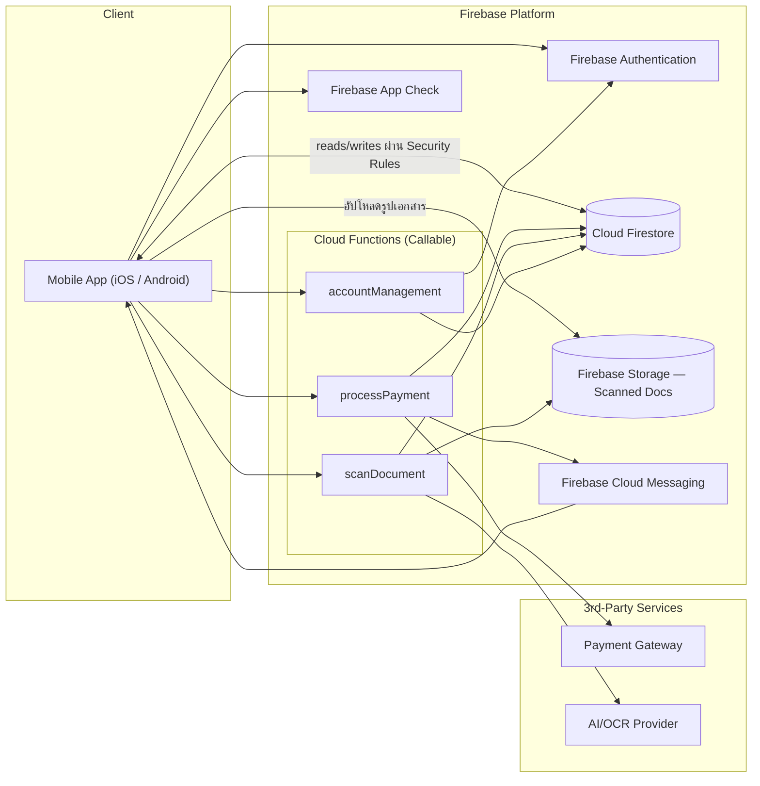
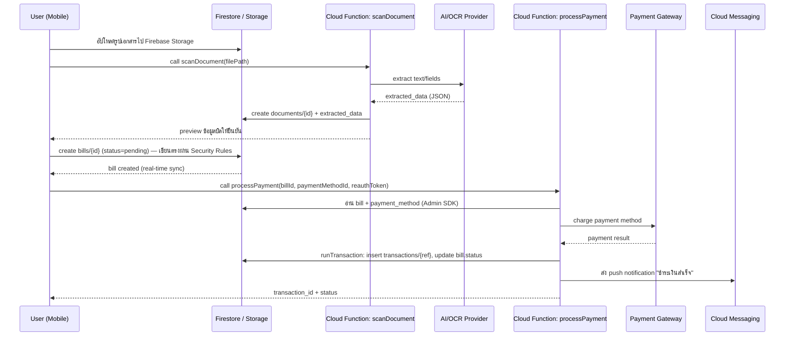

# Technical Specification — AI Life Admin (Firebase Architecture)

> โครงสร้างเอกสารอ้างอิงตามแนวทางใน [RAISE2_W4D1_TechnicalSpec.pdf](RAISE2_W4D1_TechnicalSpec.pdf): High-Level Design → API Spec → Database Schema → Detailed Design → Non-Functional Requirement
> ขอบเขตฟีเจอร์อ้างอิงจากหน้าจอแอป AI Life Admin (Onboarding, Auth & Security, Home/Services, Document Scan, Payment, Account/Security Management)
> **Backend Platform: Firebase** (Authentication, Firestore, Cloud Functions, Storage, Cloud Messaging)
> **ยังไม่มี Requirement Spec ฉบับทางการ** — เอกสารนี้เป็นฉบับร่างเริ่มต้น ควรทวนกับทีม Product/Business ก่อนนำไป implement จริง

---

## 0. Overview

**AI Life Admin** คือแอปผู้ช่วยจัดการธุระส่วนตัว (bills/บิล, เอกสารราชการ, การนัดหมาย) โดยใช้ AI ช่วยสแกน/อ่านเอกสารและดำเนินการชำระเงินแทนผู้ใช้ ฟีเจอร์หลักที่ปรากฏในหน้าจอแอป:

1. Onboarding — splash, เลือกภาษา, Terms & Conditions, PDPA consent
2. Authentication & Security — login (email/phone + password), OTP, Biometric (Face ID/Touch ID), PIN
3. Main Application — home (รายการบิล), services list, สแกนเอกสาร, AI extract & review
4. Payment & Action — ยืนยันการชำระเงิน (PromptPay/บัตร), re-authenticate ก่อนจ่าย, processing, success
5. Additional Security & Account Management — ลืมรหัสผ่าน, verify อุปกรณ์ใหม่, security settings, active sessions, notification preference, data & privacy, help & support

---

## 1. High-Level Design

### 1.1 System Architecture

เลือกใช้สถาปัตยกรรมแบบ **Serverless บน Firebase**: client เชื่อมต่อ Firestore/Storage โดยตรง (คุมสิทธิ์ด้วย Security Rules) สำหรับ CRUD ทั่วไป และเรียก **Cloud Functions** เฉพาะ operation ที่ต้อง trust ฝั่ง server (ชำระเงิน, เรียก AI/OCR, ส่ง notification) — ลดภาระดูแล server เอง เหมาะกับทีมเล็ก-กลางและ MVP ที่ต้องออกตลาดเร็ว:



### 1.2 Technology Stack

| Layer | Technology | เหตุผล |
|---|---|---|
| Frontend / Client | React Native (iOS/Android) | ใช้ codebase เดียวสำหรับสองแพลตฟอร์ม, มี Firebase SDK รองรับครบ |
| Authentication | **Firebase Authentication** | รองรับ Email/Password + Phone OTP (native), MFA, session/ID token จัดการให้อัตโนมัติ ไม่ต้องเขียนระบบ auth เอง |
| Backend Logic | **Cloud Functions for Firebase** (Node.js/TypeScript) | ใช้เฉพาะ operation ที่ต้อง trust ฝั่ง server (ชำระเงิน, เรียก AI API ที่มี secret key, ส่งแจ้งเตือน) — scale อัตโนมัติ ไม่ต้องดูแล server |
| Database | **Cloud Firestore** (NoSQL) | Real-time sync กับ client ได้ทันที, scale อัตโนมัติ, ผูกกับ Security Rules เพื่อคุมสิทธิ์ระดับ document |
| File Storage | **Firebase Storage** | เก็บรูปเอกสารที่สแกน ผูก Security Rules กับ Firebase Auth UID ได้โดยตรง |
| Push Notification | **Firebase Cloud Messaging (FCM)** | ส่ง push notification ข้าม iOS/Android ด้วยระบบเดียว |
| Bot/Abuse Protection | **Firebase App Check** | ป้องกัน request ที่ไม่ได้มาจากแอปจริง (ทดแทนส่วนหนึ่งของ rate limiting) |
| AI/OCR | 3rd-party AI Vision API (เรียกผ่าน Cloud Functions เพื่อไม่ให้ API key รั่วสู่ client) | สกัดข้อมูลจากเอกสาร (บัตรประชาชน, ใบแจ้งหนี้) |
| Payment Gateway | 3rd-party PG (รองรับ PromptPay + บัตรเครดิต/เดบิต) เรียกผ่าน Cloud Functions | ลดขอบเขต PCI-DSS ของระบบเราเอง และป้องกันการปลอมสถานะจ่ายเงินจาก client |
| Hosting/Infra | Firebase Hosting (ถ้ามีเว็บ) + Google Cloud project เดียวกับ Firebase | ผูก IAM/monitoring อยู่ใน ecosystem เดียว |

### 1.3 Data Flow (ตัวอย่าง: ชำระค่าบิลจากเอกสารที่สแกน)



### 1.4 Authentication & Authorization

**Authentication**
- Primary: **Firebase Authentication** ด้วย Email/Password และ Phone Number (รองรับ OTP ผ่าน SMS แบบ native โดยไม่ต้องสร้างระบบ OTP เอง)
- Multi-Factor: เปิดใช้ Firebase Auth **Multi-Factor Authentication (SMS-based second factor)** บังคับตอน login ครั้งแรกและอุปกรณ์ใหม่
- Biometric (Face ID/Touch ID) และ PIN 6 หลัก ตรวจสอบระดับอุปกรณ์ (local secure storage/keychain) แล้วใช้ Firebase `reauthenticateWithCredential()` เพื่อยืนยันตัวตนซ้ำ (step-up authentication) ก่อนเรียก Cloud Function ที่มีผลด้านการเงิน
- Session: Firebase Authentication ออก **ID Token (JWT)** ให้อัตโนมัติ อายุ 1 ชั่วโมง และ refresh token ที่ SDK จัดการ renew ให้เอง — ไม่ต้องมี token/refresh-token table แยกเหมือนระบบ backend เอง
- Custom claims (เช่น `status: suspended`) ใช้ตั้งผ่าน Admin SDK เพื่อ enforce สิทธิ์ระดับผู้ใช้ที่ต้อง revoke การเข้าถึงทันที

**Authorization**
- แอปเป็น consumer app แบบ single-role (เจ้าของบัญชีเข้าถึงข้อมูลของตัวเองเท่านั้น) — ใช้ **Firestore Security Rules** เป็นชั้นบังคับสิทธิ์หลัก: `request.auth.uid == resource.data.user_id`
- Operation ที่กระทบข้อมูลการเงิน (`bills.status=paid`, `transactions`) เขียนได้เฉพาะผ่าน **Cloud Functions ด้วย Admin SDK** (ซึ่ง bypass Security Rules โดยธรรมชาติ) — client ไม่มีสิทธิ์เขียนตรง ป้องกันการปลอมข้อมูลจากฝั่งอุปกรณ์
- ไม่มี RBAC หลายระดับในระยะ MVP (ยังไม่มี admin/staff role ในสโคปที่เห็นจาก UI) — หากต้องมี back-office ในอนาคต แนะนำใช้ Firebase custom claims (`role: admin`) ร่วมกับ Security Rules แยกชุด

---

## 2. Database Schema

ดูรายละเอียดฉบับเต็ม (Conceptual → Logical ERD → Firestore Data Model → Security Rules) ที่ [docs/database-schema.md](database-schema.md)

Collection หลัก: `users/{uid}` (+ subcollections: `devices`, `payment_methods`, `notifications`, `consents`, `security_logs`, `settings/notification_preferences`), และ top-level collections: `documents`, `service_categories`, `bills`, `transactions`

---

## 3. API Spec (Client Data Access & Cloud Functions)

แอป Firebase ไม่ได้มี REST API ชุดเดียวแบบ backend ดั้งเดิม แต่แบ่งเป็น 2 รูปแบบการเข้าถึงข้อมูล:

1. **Direct Firestore/Storage Access** — client อ่าน/เขียนผ่าน Firebase SDK โดยตรง คุมสิทธิ์ด้วย Security Rules (ใช้กับ CRUD ทั่วไปที่ไม่ต้อง trust พิเศษ)
2. **Callable Cloud Functions** — ใช้เมื่อ logic ต้องรันฝั่ง server (ชำระเงิน, เรียก AI ที่มี secret key, ส่ง notification, ผูก custom claims)

### 3.1 Direct Firestore/Storage Access

| Data | Collection Path | Operation | Security Rule สรุป |
|---|---|---|---|
| โปรไฟล์ผู้ใช้ | `users/{uid}` | read, update (บาง field) | `auth.uid == uid` |
| รายการอุปกรณ์/Active Sessions | `users/{uid}/devices` | read, delete | `auth.uid == uid` |
| ช่องทางชำระเงิน | `users/{uid}/payment_methods` | read, create, delete | `auth.uid == uid` |
| การแจ้งเตือน | `users/{uid}/notifications` | read, update (`is_read`) | `auth.uid == uid` |
| การตั้งค่าแจ้งเตือน | `users/{uid}/settings/notification_preferences` | read, update | `auth.uid == uid` |
| Consent (Terms/PDPA) | `users/{uid}/consents` | read, create | `auth.uid == uid` |
| หมวดบริการ | `service_categories` | read only | ผู้ใช้ที่ login แล้วอ่านได้ทุกคน |
| รายการบิล | `bills` (query `where user_id == uid`) | read, create | `auth.uid == resource.user_id`; **ห้าม update `status` เป็น `paid` เอง** |
| เอกสารที่สแกน | `documents` (query `where user_id == uid`) | read | สร้าง/แก้ไขได้เฉพาะผ่าน Cloud Function |
| ธุรกรรม | `transactions` (query `where user_id == uid`) | read only | เขียนได้เฉพาะ Cloud Function |
| อัปโหลดรูปเอกสาร | Storage: `users/{uid}/documents/*` | write (upload) | `auth.uid == uid`, จำกัดชนิด/ขนาดไฟล์ |

Validation ที่บังคับใน Security Rules: ชนิดไฟล์ JPG/PNG/PDF และไม่เกิน 10MB, `bills.amount > 0`, ห้าม client set `bills.status == 'paid'` หรือเขียน `transactions` โดยตรง

### 3.2 Callable Cloud Functions

| Function | Trigger | Description | Auth |
|---|---|---|---|
| `setupBiometric` | Callable | บันทึก `biometric_enabled = true` พร้อม log security event | Firebase Auth (ID Token) |
| `setPin` | Callable | ตั้ง/เปลี่ยน PIN — hash ฝั่ง server ก่อนบันทึกลง `users/{uid}.pin_hash` | Firebase Auth |
| `reauthenticate` | Callable | ออก short-lived `reauth_token` หลังยืนยัน PIN/Biometric สำเร็จ สำหรับใช้ step-up ก่อนจ่ายเงิน | Firebase Auth |
| `scanDocument` | Callable | รับ path รูปใน Storage → เรียก AI/OCR → บันทึก `documents/{id}` | Firebase Auth |
| `processPayment` | Callable | ชำระบิล: เรียก Payment Gateway, เขียน `transactions` + update `bills.status` แบบ atomic (Firestore transaction), ส่ง FCM | Firebase Auth + reauth_token |
| `deleteAccount` | Callable | ลบบัญชีผู้ใช้และข้อมูลที่เกี่ยวข้องทั้งหมด (GDPR/PDPA) | Firebase Auth + reauth_token |
| `onBillOverdue` | Cloud Scheduler (ไม่ใช่ callable) | ไล่เช็ค `bills` ที่ `due_date` ผ่านและยัง `pending` ทุกวัน → สร้าง notification | Internal (Admin SDK) |

**ตัวอย่าง: `processPayment` (Callable Function)**
```json
// Request (data ที่ส่งผ่าน httpsCallable)
{ "bill_id": "bill_abc123", "payment_method_id": "pm_xyz789", "reauth_token": "reauth_ab12..." }

// Response
{
  "transaction_id": "TX2025061500001",
  "status": "success",
  "amount": 1245.00,
  "paid_at": "2025-06-15T10:24:00+07:00"
}
```

Validation rules: `reauth_token` ต้องยังไม่หมดอายุ (ออกภายใน 5 นาทีล่าสุด), `bill.status` ต้องเป็น `pending` เท่านั้น, `payment_method_id` ต้องเป็นของ user ที่เรียก (ตรวจใน function ด้วย Admin SDK)

### 3.3 Error / Status Codes (Callable Functions ใช้ `functions.https.HttpsError`)

`invalid-argument` (validation ผิด) · `unauthenticated` (ไม่มี/หมดอายุ ID token) · `permission-denied` (ไม่ใช่เจ้าของ resource หรือ reauth หมดอายุ) · `not-found` · `failed-precondition` (เช่น จ่ายบิลที่จ่ายไปแล้วซ้ำ — เทียบเท่า `409 Conflict`) · `resource-exhausted` (rate limit) · `unavailable` (3rd-party/Payment Gateway ล่ม) · `internal`

---

## 4. Detailed Design

### 4.1 Business Logic — Pay Bill Flow (`processPayment` Cloud Function)

```
1. ตรวจสอบ Firebase ID Token (auth context ของ callable function) และ reauth_token (ต้องออกภายใน 5 นาทีล่าสุด)
2. โหลด bills/{bill_id} ด้วย Admin SDK — ตรวจ bill.user_id == auth.uid (ownership check)
3. ตรวจสถานะ bill: ถ้า status != "pending" → throw failed-precondition
4. โหลด users/{uid}/payment_methods/{payment_method_id} (ownership check โดย path)
5. เริ่ม Firestore runTransaction():
   a. อ่าน bill อีกครั้งภายใน transaction (กัน race condition จากการจ่ายซ้ำพร้อมกัน)
   b. เรียก Payment Gateway ด้วย amount + gateway_token_ref (อยู่นอก transaction เพราะเป็น external call)
   c. ถ้า PG สำเร็จ:
        - set transactions/{transaction_ref} (status=success) — ใช้ transaction_ref เป็น doc ID กันบันทึกซ้ำ
        - update bill.status = "paid" ภายใน transaction เดียวกัน (atomic)
   d. ถ้า PG ล้มเหลว:
        - set transactions/{transaction_ref} (status=failed)
        - ไม่แตะ bill.status
6. หลัง transaction commit สำเร็จ → เรียก FCM ส่ง notification "ชำระเงินสำเร็จ"
7. คืนผลลัพธ์ transaction_id + status ให้ frontend
```

### 4.2 Exception & Error Handling

| Case | สาเหตุ | Handling | Response |
|---|---|---|---|
| จ่ายบิลซ้ำ (double submit / race condition) | ผู้ใช้กดจ่ายซ้ำก่อน UI อัปเดตสถานะ | ตรวจ `bill.status` ภายใน Firestore `runTransaction()` (optimistic concurrency — ถ้าข้อมูลถูกเขียนแทรกระหว่างทาง transaction จะ retry/fail ให้เอง) | `failed-precondition` — "บิลนี้ถูกชำระแล้ว" |
| Payment Gateway ไม่ตอบสนอง/error | 3rd-party ล่มหรือ timeout | catch error ใน Cloud Function, บันทึก transaction เป็น `failed`, ไม่ update bill | `unavailable` — "ระบบชำระเงินขัดข้อง กรุณาลองใหม่ภายใน 5 นาที" |
| OTP ผิดเกินจำนวนที่กำหนด | brute-force พยายามเดา OTP | Firebase Authentication มี rate limiting ในตัวสำหรับ Phone Auth; เสริมด้วย App Check กัน request ปลอม | `resource-exhausted` (ตาม error ของ Firebase Auth SDK) |
| Reauth token หมดอายุ | ผู้ใช้ค้างหน้าจอยืนยันการชำระเงินนานเกินไป | `processPayment` ตรวจอายุ `reauth_token` ก่อนดำเนินการทุกครั้ง | `permission-denied` — ต้อง re-authenticate |
| AI extract ข้อมูลเอกสารไม่ครบ/ผิด | คุณภาพรูปภาพต่ำ หรือ AI confidence ต่ำ | `scanDocument` ให้ frontend แสดงหน้าจอแก้ไขข้อมูลด้วยตนเอง | สำเร็จ พร้อม flag `needs_review: true` ใน `documents.extracted_data` |

### 4.3 Security

- **Input Validation & Sanitization**: validate ทุก payload ทั้งใน Cloud Function (server-side) และ Security Rules (เช่น `bills.amount > 0`, ชนิด/ขนาดไฟล์ที่อัปโหลด) กัน injection และข้อมูลผิดรูปแบบ
- **Rate Limiting / Abuse Protection**: เปิดใช้ **Firebase App Check** ทุก entry point (Firestore, Storage, Cloud Functions) เพื่อบล็อก request ที่ไม่ได้มาจากแอปจริง ร่วมกับ Firebase Auth rate limit ในตัวสำหรับ login/OTP
- **Data Masking**: เลขบัตร/เบอร์โทร/เลขบัตรประชาชนแสดงแบบ mask ในทุก response และ log — ไม่เก็บ raw data ใน Firestore
- **Secrets & PCI-DSS scope**: ไม่เก็บเลขบัตร/PromptPay แบบเต็มในระบบ ใช้ `gateway_token_ref` จาก Payment Gateway แทน; secret key ของ Payment Gateway/AI Provider เก็บใน Cloud Functions environment config (ไม่ฝังใน client)
- **Transport & Storage**: Firebase บังคับ TLS ทุก connection โดยดีฟอลต์; PIN เก็บแบบ hash (สร้างผ่าน Cloud Function เท่านั้น); Firebase Storage เข้ารหัสข้อมูล at-rest ให้อัตโนมัติ
- **Authorization Enforcement**: ข้อมูลการเงิน (`bills.status=paid`, `transactions`) เขียนได้เฉพาะผ่าน Cloud Functions (Admin SDK) — Security Rules ปิดกั้น client ไม่ให้เขียนตรงตามที่ระบุใน [database-schema.md](database-schema.md#5-firestore-security-rules-สรุปหลักการ)
- **Step-up Authentication**: การกระทำที่มีผลด้านการเงิน (ชำระบิล, เพิ่ม/ลบ payment method, ลบบัญชี) ต้องผ่าน re-auth (Face ID/PIN → `reauth_token`) ที่อายุไม่เกิน 5 นาที

---

## 5. Non-Functional Requirements (NFR)

| หมวด | เป้าหมาย |
|---|---|
| **Performance** | Firestore read/write latency < 200ms (p95) ในภูมิภาคเดียวกัน, Cloud Function (payment) ตอบกลับ < 3 วินาทีรวมเวลาเรียก Payment Gateway |
| **Scalability** | Firestore และ Cloud Functions scale อัตโนมัติตาม concurrent users โดยไม่ต้องจัดการ infrastructure เอง — ตั้งเป้ารองรับ 5,000+ concurrent users ในระยะแรกโดยไม่ปรับ config เพิ่ม |
| **Availability & Reliability** | อิง Firebase SLA (Firestore multi-region ~99.999%, Cloud Functions ~99.95%), มี retry/backoff เมื่อเรียก 3rd-party (Payment Gateway/AI) ล้มเหลว |
| **Security** | PIN hash ด้วย bcrypt ผ่าน Cloud Function, บังคับ MFA (Phone OTP) สำหรับ login ครั้งแรก/อุปกรณ์ใหม่, Firebase App Check ทุก entry point, Security Rules ปิดกั้นการเขียนข้อมูลการเงินจาก client |
| **Usability** | Flow การชำระบิลจากการสแกนเอกสารจนจบ ไม่เกิน 3 ขั้นตอนหลัก (สแกน → ตรวจสอบ → ยืนยัน) |
| **Maintainability** | ทุก Cloud Function มี structured logging (Cloud Logging) + error tracking, code coverage ของ business logic หลัก ≥ 70% |

---

## 6. ข้อสมมติฐาน & สิ่งที่ต้องทวนสอบ

- เอกสารนี้ร่างจากหน้าจอ UI/mockup ที่มีอยู่ ไม่ใช่จาก Requirement Spec/Feature List ฉบับทางการ — ควรทวนกับทีม Product ก่อน
- เลือก Firebase ตามที่ผู้ใช้ระบุ — เหมาะกับ MVP ที่ต้องการความเร็วในการพัฒนาและลดภาระ infra แต่ควรพิจารณา cost model ของ Firestore (คิดตามจำนวน read/write/delete) และ vendor lock-in กับ Google Cloud ก่อน commit ระยะยาว
- ยังไม่ครอบคลุม Admin/Back-office (เช่น จัดการ `service_categories`) เนื่องจากไม่ปรากฏใน mockup ที่ให้มา — แนะนำจัดการผ่าน Firebase Console/สคริปต์ Admin SDK ไปก่อนในระยะ MVP
- Payment Gateway และ AI/OCR Provider ยังไม่ระบุเจาะจง ต้องเลือกตาม Technology Selection Criteria (Vendor Support, Cost, Compliance) และตรวจว่ามี SDK/REST API ที่เรียกจาก Cloud Functions ได้สะดวก
- Email OTP (ถ้าต้องการ) ไม่มีใน Firebase Auth แบบ native ต้องออกแบบเพิ่มเติมตามที่ระบุใน [database-schema.md](database-schema.md#6-ข้อสมมติฐาน--สิ่งที่ต้องทวนสอบ)
